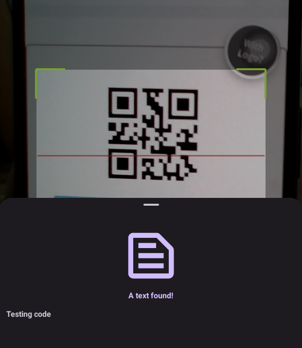
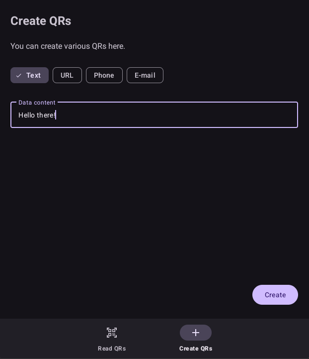
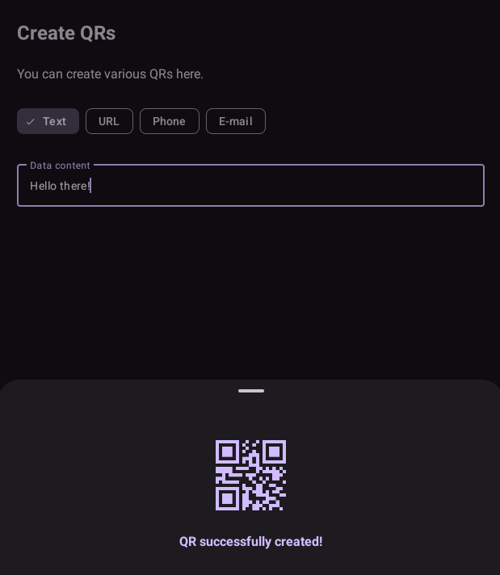

# 📱 QRify

**QRify** is a modern and user-friendly **QR code scanner and generator** app for Android. With its minimalist interface and clean design, it makes scanning and creating QR codes **quick and easy**.

## 🚀 Features
- Real-time camera scanning with automatic content detection (text, phone, email, WiFi, link).
- Generate custom QR codes based on user input such as text, links, phone numbers, or emails.
- Modern dark mode support for a sleek and eye-friendly look.

## 📸 Screenshots

<table>
  <tr>
    <td> </td>
   </tr> 
</table>

<table>
  <tr>
    <td> </td>
   </tr> 
</table>

<table>
  <tr>
    <td> </td>
   </tr> 
</table>

## 🧠 Built With

- `Kotlin`  
- `ZXing for Barcode processes`   
- `BottomSheetDialogFragment`

## 📦 Compile

1. Clone the repository:
   ```bash
   git clone https://github.com/gorkemoji/android_packages_apps_QRify.git

2. Open with Android Studio and press run button!
